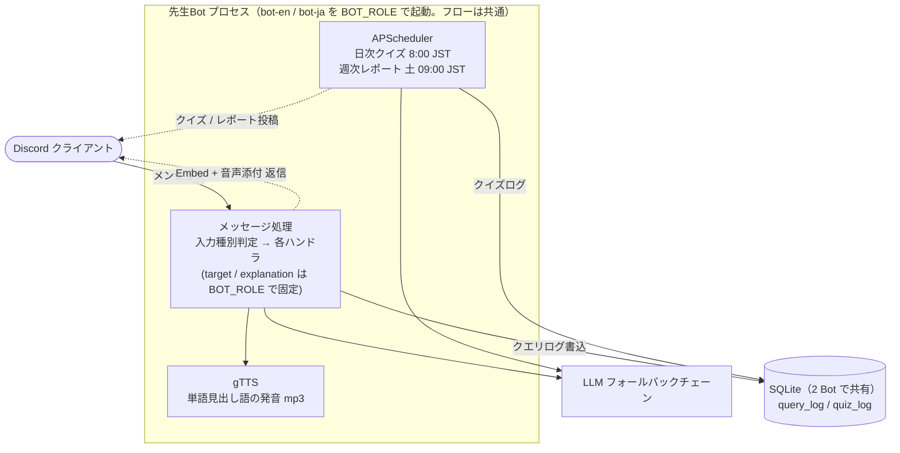

# Language Teacher Discord Bot — アーキテクチャ / 技術構成

---

## 1. 技術スタック

| レイヤ              | 技術                                                     | 役割                                                            |
| ------------------- | -------------------------------------------------------- | --------------------------------------------------------------- |
| 言語                | Python 3.11+                                             | 実装言語                                                        |
| Discord ライブラリ  | discord.py 2.x                                           | Discord 接続・メッセージ / インタラクション処理                 |
| LLM(一次/二次)      | Gemini API(`gemini-3.1-flash-lite` → `gemini-3.5-flash`) | 分類・解説・クイズ生成。一次が 404/429/5xx を返すと二次へ        |
| LLM(フォールバック) | OpenRouter(任意、モデルは env 指定)                      | Gemini 全段が枯渇した時の最終フォールバック(1.1 参照)           |
| TTS                 | gTTS(Google Translate TTS)                               | 単語見出し語の発音 mp3 合成(en / ja)                            |
| データベース        | SQLite                                                   | クエリログ・クイズログの保存(2 Bot で共有)                     |
| スケジューラ        | APScheduler                                              | 日次クイズ・週次レポートの cron 実行                            |
| パッケージ管理      | uv                                                       | 依存関係・仮想環境の管理                                        |

### 1.1 LLM フォールバックチェーン

すべての LLM 呼び出しは `src/llm/client.py` の `generate()` を入口とし、以下のチェーンを優先順に試す。各段が「レート/クォータ超過・モデル不在・サーバ過負荷」を返したら次段へフォールバックし、それ以外の例外は即座に伝播する。

| 順  | プロバイダ | モデル                      | フォールバック対象コード    | 有効化条件                                                              |
| --- | ---------- | --------------------------- | --------------------------- | ----------------------------------------------------------------------- |
| ①   | Gemini     | `gemini-3.1-flash-lite`     | 404 / 429 / 500 / 502 / 503 | 常時(`GEMINI_API_KEY` 必須)                                             |
| ②   | Gemini     | `gemini-3.5-flash`          | 404 / 429 / 500 / 502 / 503 | 常時                                                                    |
| ③   | OpenRouter | env `OPENROUTER_MODEL` の値 | 429 / 500 / 502 / 503       | `OPENROUTER_API_KEY` と `OPENROUTER_MODEL` の両方が設定されている時のみ |

- 戻り値は生成テキストに加え、実際に応答したモデル名・プロバイダ名を含む(`LLMResult`)。これを Embed フッターの `via {モデル名}` 表示に使う(OpenRouter はプロバイダ名も併記)。
- 全段を使い切ると `LLMError("All LLM backends are exhausted")` を送出。
- OpenRouter モデルは環境変数で差し替え可能(運用時の採用例: `qwen/qwen3-next-80b-a3b-instruct:free`)。`scripts/deploy.sh` が SSM から任意取得し、未登録なら Gemini のみで動作する。

---

## 2. システム構成

### 2.1 構成図

> en_teacher / ja_teacher は処理フローが共通(差は `BOT_ROLE` で固定される target/explanation と辞書リンク先のみ)なので、1 本のフローで表す。実体は同一コードを `bot-en` / `bot-ja` の 2 プロセスで起動している。



### 2.2 Bot ロールによる役割固定

- `BOT_ROLE` 環境変数で各 Bot の `target_lang` / `explanation_lang` と辞書リンク先を固定する。
  - `BOT_ROLE=en_teacher`(英語先生Bot): target=en / explanation=ja。Cambridge リンク。
  - `BOT_ROLE=ja_teacher`(日本語先生Bot): target=ja / explanation=en。Jisho リンク。日本語の漢字には振り仮名を付与。
- 振り分けルール: ユーザーは自分が学んでいる言語の先生Bot にメンションする。入力文字種は分岐に使わない。
- 入力が target / explanation のどちらの言語でも受け付ける。入力が explanation_lang の語句なら target_lang の equivalent を主見出しに据えて返す(逆引き対応。word / sentence ハンドラのプロンプトで実装、漢字には振り仮名)。
- 構成上、Discord Bot 登録は 2 件、プロセスは 2 つ(`docker-compose.yml` の 2 サービス)。

### 2.3 1 コードベース・2 サービス構成

- ソースは 1 つ。`BOT_ROLE` 環境変数(`en_teacher` / `ja_teacher`)で実行時の役割を決定。
- `src/config.py` の `load_bot_config()` が `BOT_ROLE` を読み、`(target_lang, explanation_lang, dictionary_url_template, learner_discord_id, learner_name)` をまとめて返す。
- `docker-compose.yml` に `bot-en` / `bot-ja` の 2 サービスを定義。`env_file` は `.env.en` / `.env.ja` を指定。`./data` ボリュームは両サービスで共有(SQLite を共有)。

### 2.4 プロセス起動

```bash
# Docker(両方一括)
docker compose up -d

# ローカル(個別)
BOT_ROLE=en_teacher uv run python src/main.py
BOT_ROLE=ja_teacher uv run python src/main.py
```

---

## 3. データモデル

### 3.1 SQLite スキーマ

```sql
CREATE TABLE query_log (
    id INTEGER PRIMARY KEY AUTOINCREMENT,
    kind TEXT NOT NULL,               -- 'word' | 'sentence' | 'grammar'
    target_lang TEXT NOT NULL,        -- 'en' or 'ja' (検索対象の言語)
    discord_user_id TEXT NOT NULL,
    discord_user_name TEXT NOT NULL,
    query_text TEXT NOT NULL,         -- ユーザーが入力した単語/文/文法質問
    result_summary TEXT,              -- word=見出し語(/区切り) / sentence=自然訳 / grammar=トピック
    reading TEXT,                     -- 漢字見出し/原文の振り仮名(週次レポート表示用、なければ空)
    queried_at TEXT NOT NULL          -- ISO8601 (JST)
);
-- 注: reading 列は後付け追加のため init 時に PRAGMA でチェックし、無ければ ALTER TABLE で自動マイグレーションする。

CREATE INDEX idx_query_log_queried_at ON query_log(queried_at);
CREATE INDEX idx_query_log_user_kind ON query_log(discord_user_id, target_lang, kind);

-- デイリークイズ機能用
CREATE TABLE quiz_log (
    id                 INTEGER PRIMARY KEY AUTOINCREMENT,
    discord_user_id    TEXT    NOT NULL,
    target_lang        TEXT    NOT NULL,  -- 'en' | 'ja'
    kind               TEXT    NOT NULL,  -- 'word' | 'grammar' (現状 word のみ)
    mode               TEXT    NOT NULL,  -- 'review' | 'new'
    source_text        TEXT    NOT NULL,  -- 出題対象 (単語 or 文法パターン)
    question_text      TEXT    NOT NULL,  -- 表示する問題文
    choices_json       TEXT    NOT NULL,  -- 4 択 (JSON 配列)
    correct_index      INTEGER NOT NULL,  -- 0-3
    explanation        TEXT    NOT NULL,  -- 解説
    message_id         TEXT,              -- Discord メッセージ ID (button 受付用)
    delivered_at       TEXT    NOT NULL,  -- ISO8601 (JST)
    answered_at        TEXT,              -- 回答時刻、未回答なら NULL
    user_answer_index  INTEGER,           -- 0-3、未回答なら NULL
    is_correct         INTEGER            -- 0/1、未回答なら NULL
);

CREATE INDEX idx_quiz_user_delivered ON quiz_log(discord_user_id, delivered_at DESC);
CREATE INDEX idx_quiz_message        ON quiz_log(message_id);
CREATE INDEX idx_quiz_user_source    ON quiz_log(discord_user_id, source_text);

-- 追加クイズ(おかわり)の 1 日 1 回制限用(bot-spec.md の「追加クイズ(おかわり)」参照)
CREATE TABLE quiz_addon (
    discord_user_id  TEXT NOT NULL,
    target_lang      TEXT NOT NULL,
    used_date        TEXT NOT NULL,   -- JST の日付 (YYYY-MM-DD)
    UNIQUE(discord_user_id, target_lang, used_date)
);
```

### 3.2 設定(`.env.{en,ja}` 経由 + コード定数)

`BOT_ROLE` を起点に `src/config.py` の `load_bot_config()` が他の固定値を導出する。Bot ごとに別 env ファイル(`.env.en` / `.env.ja`)を用意し、`docker-compose.yml` でサービスごとに `env_file` を割り当てる。

| 設定項目                    | 変数 / 定数名           | 配置                                       |
| --------------------------- | ----------------------- | ------------------------------------------ |
| Bot ロール                  | `BOT_ROLE`              | `.env.{en,ja}`                             |
| Discord Bot トークン        | `DISCORD_BOT_TOKEN`     | `.env.{en,ja}`(Bot ごとに別)               |
| Gemini API キー             | `GEMINI_API_KEY`        | `.env.{en,ja}`                             |
| OpenRouter API キー(任意)   | `OPENROUTER_API_KEY`    | `.env.{en,ja}`                             |
| OpenRouter モデル(任意)     | `OPENROUTER_MODEL`      | `.env.{en,ja}`                             |
| 英→日 辞書 URL テンプレート | `_CAMBRIDGE_URL`        | `src/config.py` 定数(`en_teacher` で採用)  |
| 日→英 辞書 URL テンプレート | `_JISHO_URL`            | `src/config.py` 定数(`ja_teacher` で採用)  |
| レポート投稿チャンネル ID   | `REPORT_CHANNEL_ID`     | `.env.{en,ja}`(Bot ごとに別チャンネル)     |
| クイズ投稿チャンネル ID     | `QUIZ_CHANNEL_ID`       | `.env.{en,ja}`(Bot ごとに別チャンネル)     |
| 英語学習者の Discord ID     | `EN_LEARNER_DISCORD_ID` | `.env.{en,ja}`(`en_teacher` で使用)        |
| 日本語学習者の Discord ID   | `JA_LEARNER_DISCORD_ID` | `.env.{en,ja}`(`ja_teacher` で使用)        |
| 英語学習者の表示名          | `EN_LEARNER_NAME`       | `.env.{en,ja}`                             |
| 日本語学習者の表示名        | `JA_LEARNER_NAME`       | `.env.{en,ja}`                             |

---

## 付録: ディレクトリ構成

```
language-teacher/
├── docs/
│   ├── README.md             # ドキュメント索引
│   ├── requirements.md       # 要件定義
│   ├── architecture.md       # 技術構成(本ドキュメント)
│   ├── bot-spec.md           # Bot 挙動仕様
│   └── aws-infrastructure.md # dev/prod 分離のインフラ設計
├── README.md                 # セットアップ手順
├── .env.example              # env 記入例
├── .gitignore
├── pyproject.toml            # 依存関係(uv)
├── Dockerfile
├── docker-compose.yml        # bot-en / bot-ja の 2 サービス
├── scripts/
│   └── deploy.sh             # EC2 デプロイ(SSM から env 生成)
├── src/
│   ├── main.py               # discord.py のエントリ(on_message / on_interaction)
│   ├── config.py             # BOT_ROLE から BotConfig を導出
│   ├── handlers/             # router / word / sentence / grammar / quiz ハンドラ
│   ├── lib/                  # dispatcher / embeds / scheduler / script(言語判定) / tts(gTTS)
│   ├── llm/                  # client(フォールバックチェーン) / gemini_backend / openrouter_backend / errors
│   ├── db/                   # SQLite アクセス(query_log / quiz_log)
│   ├── quiz/                 # daily(出題ロジック) / poster(Embed・ボタン)
│   ├── reports/              # weekly(レポート Embed) / weekly_view(Anki CSV ボタン) / anki_card(カード整形)
│   └── scripts/              # run_report / try_quiz(手動トリガ用)
├── data/
│   └── language_teacher.db   # SQLite 本体(.gitignore)
└── tests/
```
