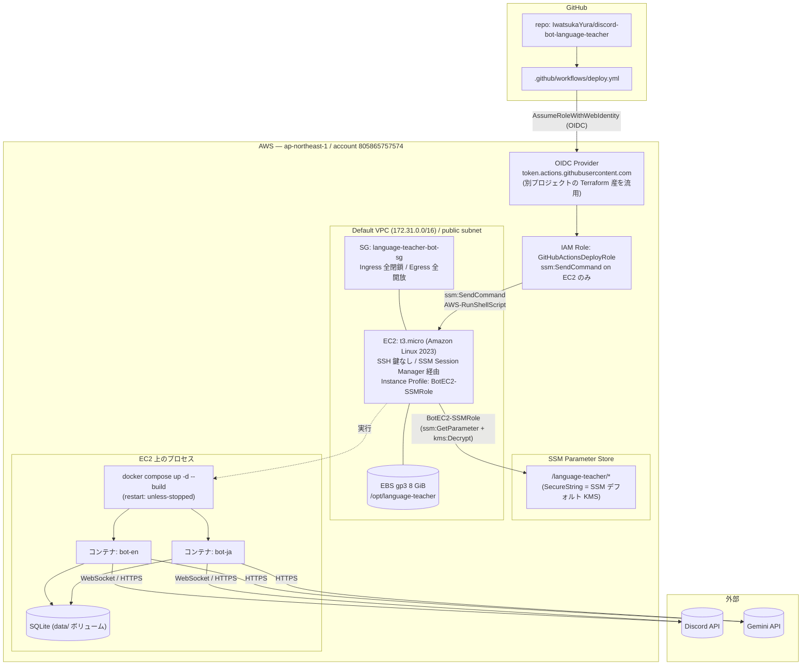

# AWS インフラ — システム構成と設計判断

| 項目         | 内容                                                                |
| ------------ | ------------------------------------------------------------------- |
| 作成日       | 2026-05-26                                                          |
| 範囲         | 過去に手動構築された AWS リソースの**設計意図**と**判断根拠**を後追いで記録 |
| 対象アカウント | `805865757574` / `ap-northeast-1`                                  |
| IaC          | 未導入(全リソース手動構築)                                        |

> 各リソースの ID・ARN・ポリシー本文等のリファレンス情報はこのドキュメントには載せない(必要なら AWS Console / CLI で参照する)。本ドキュメントは「なぜこの構成にしたか」を残すことを目的とする。

---

## 1. システム構成

**デプロイの流れ**

1. `main` push → GitHub Actions が OIDC で `GitHubActionsDeployRole` を assume
2. `aws ssm send-command` で EC2 上に `bash /opt/language-teacher/scripts/deploy.sh` を流す
3. EC2 上の `deploy.sh` が `git reset --hard origin/main` → SSM Parameter Store から `.env` を生成 → `docker compose up -d --build`
4. GitHub Actions は `ssm:GetCommandInvocation` でステータスを polling

---

## 2. 設計判断

### 2.1 デプロイ方式: GitHub Actions OIDC + SSM Send-Command

**なぜこれを選んだか**

- **長寿命の AWS アクセスキーを GitHub に置きたくない**ため、OIDC を採用。short-lived な STS 認証情報のみで動く。
- **EC2 への SSH を一切開きたくない**ため、push 型デプロイ(GitHub から SSM 経由で EC2 にコマンド送信)を選択。SSH ポートを開けず、踏み台も不要。
- SSM Send-Command なら EC2 側の IAM(`BotEC2-SSMRole`)のみで認証され、AWS の API 側で監査・拒否が可能。

**検討した代替案**

| 案                                | 不採用理由                                                       |
| --------------------------------- | ---------------------------------------------------------------- |
| EC2 に SSH してデプロイ           | 鍵管理が必要、SSH ポート 22 を開けたくない                       |
| GitHub Actions に AWS アクセスキー | キー漏洩リスク、ローテーション運用が必要                         |
| pull 型(EC2 に cron で git pull) | 反映タイミングが遅い、デプロイ完了の可視性がない                 |
| ECS / App Runner デプロイ         | 後述「EC2 + Docker Compose」の判断で却下                         |

### 2.2 コンピュート: EC2 t3.micro × 1 台 + Docker Compose

**なぜこれを選んだか**

- 利用者は 2 人のみ、24h 稼働は必須(APScheduler の cron が prod 内に存在するため)、スケール要件なし。
- **Discord Bot の常時 WebSocket 接続**が必要なので、サーバレス系(Lambda / API Gateway)は不適。
- t3.micro(2 vCPU / 1 GiB)で 2 コンテナ + SQLite + SSM Agent は余裕で動く(構成上、メモリピークでも数百 MiB)。
- Docker Compose を使うのは、**2 つの Bot コンテナを 1 ファイルで管理**でき、ローカル開発との差分が最小になるため。

**検討した代替案**

| 案                  | 不採用理由                                                                |
| ------------------- | ------------------------------------------------------------------------- |
| ECS Fargate         | クラスター + タスク定義 + サービスの管理オーバーヘッド、コストも上昇      |
| App Runner          | バックグラウンド常駐(WebSocket 維持)が苦手、cron が組み込めない          |
| Lambda + EventBridge| Discord の WebSocket 接続を持続できない                                   |
| Lightsail           | 価格差小、AWS 本流の IAM/SSM 統合が弱い                                   |
| ローカル PC で常駐  | Mac 起動中のみ動作、24h 稼働できない(初期は手元で動かしていたが Phase 4 で EC2 に移行) |

### 2.3 SSH レス運用(Key Pair なし + Ingress 全閉鎖)

**なぜこれを選んだか**

- EC2 への運用アクセスは **SSM Session Manager** に統一(`aws ssm start-session`)。鍵ファイルを配布せず IAM で認証する。
- Ingress を全閉鎖することで、22/80/443 のいずれのスキャン攻撃も到達しない。Bot は Discord/Gemini に**アウトバウンド**で接続するだけなので Ingress 不要。

### 2.4 シークレット管理: SSM Parameter Store(SecureString)

**なぜこれを選んだか**

- 必要なのは Discord トークン・Gemini API キー等の数件。**Secrets Manager の月額固定費($0.40/secret/月)を払う規模ではない**。
- SSM Parameter Store の SecureString は AWS マネージド KMS キー(`alias/aws/ssm`)で暗号化され、本用途には十分。
- 既存の IAM(`BotEC2-SSMRole`)が `/language-teacher/*` 配下を再帰的に取れる設計のため、dev/prod の名前空間分離(`/language-teacher/prod/*`, `/language-teacher/dev/*`)を後から追加してもポリシー変更不要。

**検討した代替案**

| 案                            | 不採用理由                                                  |
| ----------------------------- | ----------------------------------------------------------- |
| AWS Secrets Manager           | コスト過剰、ローテーション機能も使わない                    |
| `.env` を EC2 に手動配置      | 更新手順が属人化、デプロイ自動化と相性が悪い                |
| GitHub Secrets から EC2 に転送 | OIDC 経由の AWS シークレット読み取りに比べて流出経路が増える |

### 2.5 コンテナレジストリなし(EC2 上で `docker build`)

**なぜこれを選んだか**

- アプリは Python の薄い Discord Bot。`uv sync --frozen --no-dev` 含めても build 時間は 1 分以内。
- 同一 EC2 上で常に最新コード(`git reset --hard`)から build するので、image tag や registry 管理が不要。
- ECR を使うと、push → pull の通信費・保管費・運用手間が増える割に、得るものが少ない。

**検討した代替案**

- **ECR + GitHub Actions で image push**: 単一 EC2 で運用する限り、レジストリを挟むメリットがほぼない(複数ノードに配布する要件がない)。dev/prod 分離後も同じ EC2 で完結するため、この判断は維持。

### 2.6 ログ: Docker ローカルログのみ(CloudWatch Logs 不使用)

**なぜこれを選んだか**

- 2 人運用の範囲で、ログを集中分析する要件はない。`docker compose logs --tail` で十分。
- CloudWatch Logs に流すと、Logs Ingestion + 保管費が常時発生。

**将来の検討余地**

- アラート(本番落ちの通知)が必要になったタイミングで、CloudWatch Logs + Metric Filter + SNS の最小構成を検討する。

### 2.7 データ永続化: EBS 上の SQLite

**なぜこれを選んだか**

- 単一プロセス(prod は実質 1 EC2)からのアクセスのみ。**SQLite で必要十分**。
- RDS / DynamoDB を入れるとマネージドサービスのランニングコストが ~$15+/月から発生し、本プロジェクトの収支に合わない。
- EC2 が落ちても EBS は残るので、再起動時にデータは保持される。

**残課題**

- **EBS スナップショットの自動取得は未設定**。DB 喪失リスクは EBS 単一障害点の確率に依存している。AWS Backup または Data Lifecycle Manager で日次スナップショット運用を将来検討。

### 2.8 ネットワーク: デフォルト VPC をそのまま使用

**なぜこれを選んだか**

- 単一インスタンス・パブリックアウトバウンドのみ。**VPC を自前設計する複雑性に見合うメリットがない**。
- Ingress を Security Group レベルで完全閉鎖しているため、デフォルト VPC のパブリックサブネットでも攻撃面は最小。

**検討した代替案**

- カスタム VPC + プライベートサブネット + NAT Gateway: NAT Gateway は $0.045/h × 24h × 30d ≈ $32/月 と高価。Bot のアウトバウンド通信(Discord/Gemini API)のために常時稼働させるのは過剰。

### 2.9 OIDC プロバイダの流用

**なぜこれを選んだか**

- 同 AWS アカウント内に別プロジェクト(`iwatsuka-portfolio`、Terraform 管理)が既に `token.actions.githubusercontent.com` の OIDC Provider を作っている。
- AWS の制約上、**1 アカウントにつき同 URL の OIDC Provider は 1 つだけ**。本プロジェクトは IAM Role の trust policy で `repo:IwatsukaYura/discord-bot-language-teacher:*` に絞り込み、既存 Provider を流用する形が自然。
- このため OIDC Provider 本体は本リポジトリで管理しない。本リポジトリの破棄/移動でも Provider は他プロジェクトで使われ続ける。

---

## 3. 現状の課題(本フェーズで対応する dev/prod 分離関連)

| # | 課題 | 対応単位 |
| - | ---- | -------- |
| 1 | 環境概念なし(`main` push が即本番反映、検証環境がない) | D-1〜D-6 |
| 2 | `.env` 単一構成で、2 Bot 化(`.env.en` / `.env.ja`)に未対応 | D-1, D-2 |
| 3 | SSM パラメータが平坦(`/language-teacher/*`)で環境分離なし | D-5 |
| 4 | `EN_LEARNER_DISCORD_ID` / `JA_LEARNER_DISCORD_ID` / `QUIZ_CHANNEL_ID` が SSM に未登録(現在はデイリークイズが無効化されているはず) | D-5 |

## 4. 中長期の課題(本フェーズでは未対応)

- EBS スナップショットの自動取得(DB 喪失リスク対策)
- 本番落ち時の通知経路(現状、自分で気づくしかない)
- IaC 化(Terraform / Pulumi 等で構成を再現可能に)
- ロードテスト・容量計画(現状は感覚で「t3.micro で足りる」と判断している)

## 5. 未確認 / 不明な情報

このドキュメント作成時点で、AWS API からは確認できなかった事項:

- **EC2 の初期セットアップ手順**(Docker のインストール、`/opt/language-teacher` の clone 元、git remote 設定など):userData 空、手動構築のためログが残っていない。
- **EC2 上の Docker / docker-compose のバージョン**:SSM Session で接続しないと不明。
- **EBS スナップショットが実は手動で取られている可能性**:未確認。
- **CloudWatch Alarm の有無**:未確認(おそらく未設定)。
- **iwatsuka-portfolio プロジェクトの Terraform 内容**:本リポジトリの管理対象外。OIDC Provider 以外に流用しているリソースはないと**信じている**が、確証はない。
